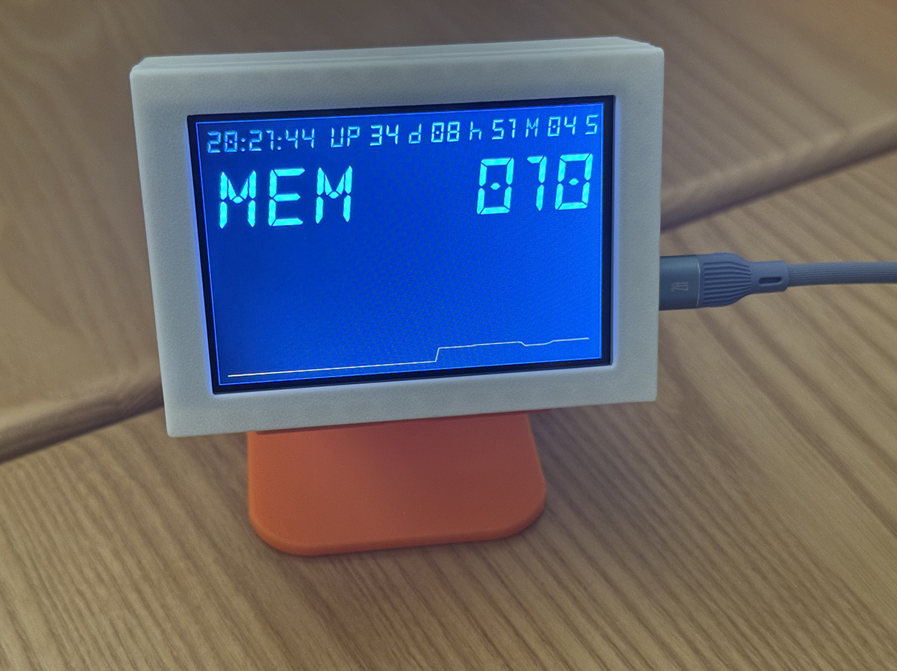

# 简易的树莓派服务器状态监视器



## 硬件

树莓派ZERO 2W + 微雪 3.5寸 LCD 屏（High SPI, 480x320） + 3D 打印外壳

详情见 [hardware/README.md](./hardware/README.md)（含系统配置过程）

## 软件

技术栈：Python + pysdl2 + pyimgui

通过读取 `node_exporter` 导出信息来展示系统状态。

### 安装

```bash
python -m venv .venv
source .venv/bin/activate
pip install -r requirements.txt
```

### 启动

```bash
export METRICS_URL='http://your-ip:9100/metrics'
python3 main.py
```

### 开机自动启动

```bash
cp startup.sh.default startup.sh
chmod +x startup.sh
vim startup.sh # modify startup.sh as you need
mkdir -p ~/.config/autostart
cat <<EOF > ~/.config/autostart/PiSystemMonitor.desktop
[Desktop Entry]
Type=Application
Name=PiSystemMonitor
Exec=/where_this_project_stores/startup.sh
EOF
```

## 其他

### 使用字体

- [FrozenCrystalBold](https://www.fontspace.com/frozen-crystal-font-f33002)

### 授权

- 代码授权：`MIT License`
- 3D 模型授权：`CC BY-NC 3.0`
