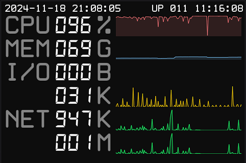

# 简易的树莓派服务器状态监视器


2024.11.18：已更新新版 UI



## 硬件

树莓派ZERO 2W + 微雪 3.5寸 LCD 屏（High SPI, 480x320） + 3D 打印外壳

详情见 [hardware/README.md](./hardware/README.md)（含系统配置过程）

## 软件

技术栈：C++ / SDL / imgui

通过读取 `node_exporter` 导出信息来展示系统状态。

### 安装

前置依赖：

```bash
sudo apt install git cmake ninja-build autoconf libtool pkg-config libx11-dev libxft-dev libxext-dev gcc g++ libwayland-dev libxkbcommon-dev libegl1-mesa-dev libibus-1.0-dev
```

需要支持 C++20 的编译器。

构建：

```bash
./build.sh
```

脚本会将产物拷贝到当前目录，可以根据需要编辑`startup.sh`。

### 启动

```bash
export METRICS_URL='http://your-ip:9100/metrics'
./PiSystemMonitor
```

### 开机自动启动

```bash
mkdir -p ~/.config/autostart
cat <<EOF > ~/.config/autostart/PiSystemMonitor.desktop
[Desktop Entry]
Type=Application
Name=PiSystemMonitor
Exec=$PWD/startup.sh
EOF
```

## 其他

### 授权

- 代码授权：`MIT License`
- 3D 模型授权：`CC BY-NC 3.0`
- UI 使用的字体请参考字体授权
